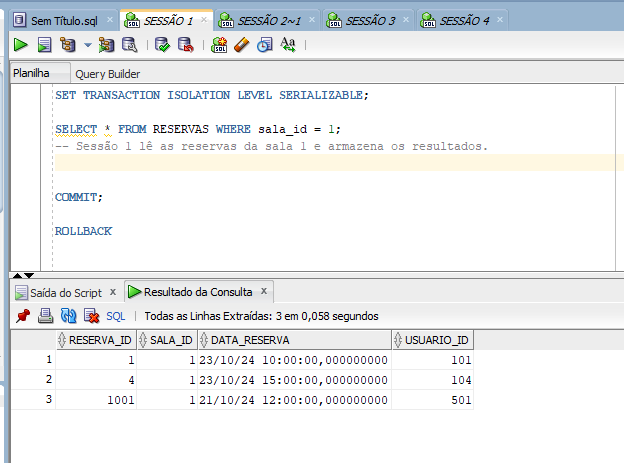

**Infraestrutura para Gestão de Dados**

**Trabalho T2**

Alunos:
**Paulo Carnovale** e **Rodrigo Oliveira Rosa**

**2024/2**

**Criação e população das tabelas**

**create**

```sql
--- create table salas
CREATE TABLE SALAS (
    sala_id INT PRIMARY KEY,
    nome_sala VARCHAR(100) NOT NULL,
    capacidade INT NOT NULL
);
--- create table reservas
CREATE TABLE RESERVAS (
    reserva_id INT PRIMARY KEY,
    sala_id INT NOT NULL,
    data_reserva TIMESTAMP NOT NULL,
    usuario_id INT NOT NULL,
    FOREIGN KEY (sala_id) REFERENCES SALAS(sala_id)
);
```

**insert**

```sql
INSERT INTO SALAS (sala_id, nome_sala, capacidade) VALUES (1, 'Sala de Reunião A', 10);
INSERT INTO SALAS (sala_id, nome_sala, capacidade) VALUES (2, 'Sala de Conferência B', 20);
INSERT INTO SALAS (sala_id, nome_sala, capacidade) VALUES (3, 'Auditório C', 50);

-- Inserir algumas reservas
INSERT INTO RESERVAS (reserva_id, sala_id, data_reserva, usuario_id) VALUES (1, 1, TO_TIMESTAMP('2024-10-23 10:00:00', 'YYYY-MM-DD HH24:MI:SS'), 101);
INSERT INTO RESERVAS (reserva_id, sala_id, data_reserva, usuario_id) VALUES (2, 2, TO_TIMESTAMP('2024-10-23 12:00:00', 'YYYY-MM-DD HH24:MI:SS'), 102);
INSERT INTO RESERVAS (reserva_id, sala_id, data_reserva, usuario_id) VALUES (3, 3, TO_TIMESTAMP('2024-10-24 14:00:00', 'YYYY-MM-DD HH24:MI:SS'), 103);

COMMIT;
```

**Relatório de execução dos testes**

A seguir temos o roteiro de execução, intercalando as operações entre as sessões para garantir que os problemas de concorrência sejam gerados. Vamos listar as sessões e as queries na ordem em que devem ser executadas para conseguirmos produzir **leitura não repetível**, **leitura fantasma** e **deadlock**.

Aqui está a versão preenchida com o objetivo:

**Problema de Dead-Lock**

**Cenário com Quatro Sessões**

**Objetivo:**

1. **Sessão 1**: Bloquear a sala 1 para atualização e manter a transação aberta até que o deadlock ocorra.
2. **Sessão 2**: Fazer leitura inicial e tentar inserir uma reserva na sala 1 para causar conflito com a Sessão 1.
3. **Sessão 3**: Inserir uma nova reserva na sala 2, sem conflitos, para simular transações concorrentes.
4. **Sessão 4**: Verificar o impacto do deadlock ao tentar atualizar a capacidade da sala 1, já bloqueada na Sessão 1.
5. **Sessão 1**: Tentar concluir a transação, demonstrando o deadlock e a resolução pelo sistema.

**Sequência de Operações**

1. Sessão 1: Inicia transação serializável e bloqueia sala 1 para atualização

```sql
SET TRANSACTION ISOLATION LEVEL SERIALIZABLE;
SELECT * FROM SALAS WHERE sala_id = 1 FOR UPDATE;
```

- A operação bloqueia a sala 1 para modificações, prevenindo que outras transações a modifiquem até o commit.


2. Sessão 2: Leitura inicial da reserva da sala 1

```sql
SET TRANSACTION ISOLATION LEVEL READ COMMITTED;
SELECT * FROM RESERVAS WHERE sala_id = 1;
```

- A leitura não interfere no bloqueio da Sessão 1 porque o nível de isolamento "read committed" permite leitura de dados confirmados.


3. Sessão 2: Insere reserva para sala 1

```sql
INSERT INTO RESERVAS (reserva_id, sala_id, data_reserva, usuario_id)
VALUES (1001, 1, TO_DATE('2024-10-21 09:00:00', 'YYYY-MM-DD HH24:MI:SS'), 501);
```

- Aqui ocorre o início do conflito, pois a Sessão 2 tenta inserir uma nova reserva na sala 1, que está bloqueada pela Sessão 1.


4. Sessão 3: Insere nova reserva na sala 2

```sql
SET TRANSACTION ISOLATION LEVEL READ COMMITTED;
INSERT INTO RESERVAS (reserva_id, sala_id, data_reserva, usuario_id)
VALUES (1002, 2, TO_DATE('2024-10-21 10:00:00', 'YYYY-MM-DD HH24:MI:SS'), 502);
```

- Essa transação ocorre sem conflitos, pois a sala 2 não está bloqueada.


5. Sessão 2: Tenta atualizar a capacidade da sala 1

```sql
UPDATE SALAS SET capacidade = 30 WHERE sala_id = 1;
```

- Nesse momento, a Sessão 2 fica travada, aguardando a liberação do bloqueio que a Sessão 1 mantém na sala 1, o que resulta no deadlock.


**Histórico SQL**


**Non-Repeatable Read**

A seguir apresentamos um cenário envolvendo **leitura não repetível** (non-repeatable read) usando quatro sessões, onde uma sessão faz uma leitura e, em seguida, outra sessão altera os dados antes que a primeira sessão faça uma nova leitura.

**Cenário com Quatro Sessões**

**Objetivo:**

1. **Sessão 1**: Lê uma reserva.
2. **Sessão 2**: Atualiza a reserva lida pela Sessão 1.
3. **Sessão 3**: Lê a mesma reserva que a Sessão 1.
4. **Sessão 4**: Realiza outra atualização e finaliza a transação.
5. **Sessão 1**: Faz uma nova leitura da reserva para observar a alteração.

**Sequência de Operações**

1. Sessão 1: Inicia a transação e lê uma reserva específica

```sql
SET TRANSACTION ISOLATION LEVEL READ COMMITTED;

SELECT * FROM RESERVAS WHERE reserva_id = 1001;
-- Sessão 1 lê a reserva com reserva_id 1001 e armazena os resultados.
```


2. Sessão 2: Inicia uma nova transação e atualiza a reserva lida pela Sessão 1

```sql
SET TRANSACTION ISOLATION LEVEL READ COMMITTED;

UPDATE RESERVAS
SET usuario_id = 502
WHERE reserva_id = 1001;
-- Sessão 2 atualiza a reserva 1001, mudando o usuario_id para 502.
```


3. Sessão 3: Inicia uma transação e lê a mesma reserva que a Sessão 1

```sql
SET TRANSACTION ISOLATION LEVEL READ COMMITTED;

SELECT * FROM RESERVAS WHERE reserva_id = 1001;
-- Sessão 3 lê a reserva 1001, deverá ver o valor original do usuario_id.
```


4. Sessão 2: Comita a transação

```sql
COMMIT;
-- A transação da Sessão 2 é comitada, a alteração do usuario_id para 502 agora é visível.
```


5. Sessão 1: Faz uma nova leitura da reserva

```sql
SELECT * FROM RESERVAS WHERE reserva_id = 1001;
-- Sessão 1 lê novamente a reserva 1001.
-- Deve observar que o usuario_id mudou para 502, mostrando a leitura não repetível.
```


**Resumo do Cenário**

1. **Sessão 1** lê a reserva 1001 e armazena os resultados, por exemplo, `usuario_id = 501`.
2. **Sessão 2** inicia uma transação e atualiza a reserva 1001, mudando o `usuario_id` para 502.
3. **Sessão 3** lê a reserva 1001 antes de a Sessão 2 ser comitada e vê o valor original, `usuario_id = 501`.
4. **Sessão 2** comita a transação, tornando a nova alteração visível.
5. **Sessão 1** faz uma nova leitura da reserva 1001 e observa que o `usuario_id` agora é 502, demonstrando o fenômeno de leitura não repetível.

**Histórico SQL**


Tabela de execução


**Problema de Phantom Read**

Vamos criar um cenário envolvendo quatro sessões diferentes para gerar o problema de **leitura fantasma** (phantom read).
O objetivo é que essas quatro sessões interajam entre si de forma a provocar diferentes estados de leitura e escrita, demonstrando claramente o fenômeno.

Cenário com Quatro Sessões

**Objetivo:**

1. **Sessão 1**: Inicia uma transação e lê as reservas.
2. **Sessão 2**: Insere uma nova reserva.
3. **Sessão 3**: Inicia uma transação e também lê as reservas.
4. **Sessão 4**: Insere uma nova reserva e finaliza a transação.
5. **Sessão 3**: Realiza uma nova leitura para observar a mudança.

**Sequência de Operações**

1. Sessão 1: Inicia a transação e lê reservas da sala 1

```sql
SET TRANSACTION ISOLATION LEVEL SERIALIZABLE;

SELECT * FROM RESERVAS WHERE sala_id = 1;
-- Sessão 1 lê as reservas da sala 1 e armazena os resultados.
```



2. Sessão 2: Inicia uma nova transação e insere uma nova reserva na sala 1

```sql
SET TRANSACTION ISOLATION LEVEL READ COMMITTED;
BEGIN;
INSERT INTO RESERVAS (reserva_id, sala_id, data_reserva, usuario_id)
VALUES (1001, 1, TO_DATE('2024-10-21 12:00:00', 'YYYY-MM-DD HH24:MI:SS'), 501);
-- Sessão 2 insere uma nova reserva para a sala 1.
```


3. Sessão 3: Inicia uma transação e lê as reservas da sala 1

```sql
SET TRANSACTION ISOLATION LEVEL SERIALIZABLE;

SELECT * FROM RESERVAS WHERE sala_id = 1;
-- Sessão 3 lê as reservas da sala 1. Neste ponto, não deve ver a nova reserva da Sessão 2.
```


4. Sessão 4: Inicia uma nova transação e insere outra nova reserva na sala 1

```sql
SET TRANSACTION ISOLATION LEVEL READ COMMITTED;

INSERT INTO RESERVAS (reserva_id, sala_id, data_reserva, usuario_id)
VALUES (1002, 1, TO_DATE('2024-10-22 14:00:00', 'YYYY-MM-DD HH24:MI:SS'), 502);
-- Sessão 4 insere outra nova reserva para a sala 1.
```


5. Sessão 2: Comita a transação

```sql
COMMIT;
-- A transação da Sessão 2 é comitada, tornando a nova reserva visível.
```


6. Sessão 3: Realiza uma nova leitura das reservas da sala 1

```sql
SELECT * FROM RESERVAS WHERE sala_id = 1;
-- Sessão 3 tenta ler novamente as reservas da sala 1.
-- Agora deve retornar o mesmo conjunto de resultados que teve na primeira leitura, pois a transação ainda está em SERIALIZABLE.
```


7. Sessão 4: Comita a transação

```sql
COMMIT;
-- A transação da Sessão 4 é comitada, tornando a nova reserva visível.
```


8. Sessão 3: Realiza uma nova leitura das reservas da sala 1

```sql
SELECT * FROM RESERVAS WHERE sala_id = 1;
-- Sessão 3 agora deve ver o conjunto de resultados que inclui as novas reservas inseridas pela Sessão 2 e Sessão 4.
-- Isso demonstra a leitura fantasma, pois os resultados mudaram após a primeira leitura.
```

A seguir demonstramos diferentes valores nas sessões.

sessão 1


sessão 2


sessão 3


sessão 4


**Resumo do Cenário**

1. **Sessão 1** lê as reservas da sala 1 e armazena os resultados.
2. **Sessão 2** insere uma nova reserva para a sala 1, mas não a comita imediatamente.
3. **Sessão 3** lê as reservas da sala 1 e não vê a nova reserva inserida pela Sessão 2.
4. **Sessão 4** insere outra nova reserva para a sala 1.
5. **Sessão 2** comita sua transação, fazendo com que a nova reserva fique visível.
6. **Sessão 3** lê novamente as reservas, mas ainda deve ver o mesmo conjunto de resultados que teve na primeira leitura.
7. **Sessão 4** comita sua transação.
8. **Sessão 3** faz uma nova leitura e agora vê o novo conjunto de resultados que inclui as reservas inseridas pelas Sessões 2 e 4, ilustrando a leitura fantasma.

**Observações Finais**

- O fenômeno de leitura fantasma é demonstrado quando a **Sessão 3**, que estava em SERIALIZABLE, lê dados antes e depois das inserções das outras sessões. O resultado muda conforme as transações são comitadas.
- A interação entre as quatro sessões e suas transações ajuda a visualizar claramente como as alterações nas transações afetam as leituras subsequentes

**Histórico SQL**


Tabela de execução


